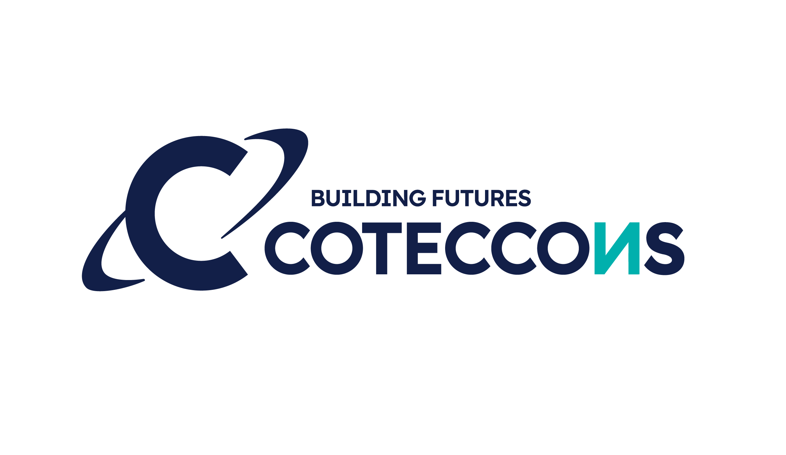

# CTD Toolkit

<div align="center">
  
  <br/><br/>
</div>

CTD Toolkit là một ứng dụng web tự host, cung cấp nhiều công cụ hỗ trợ xử lý nhanh các tác vụ hàng ngày như hình ảnh, video, âm thanh, tài liệu, dữ liệu và chuyển đổi định dạng.  
Toàn bộ quá trình xử lý được thực hiện ngay trên trình duyệt, đảm bảo sự riêng tư và tốc độ.

Ứng dụng được xây dựng bằng **React**, **TypeScript**, và **Material UI**, dễ dàng mở rộng và tích hợp thêm công cụ mới.

Cảm ơn iib0011 vì ý tưởng và đã opensource/cho phép cá nhân hóa để tôi có thể thực hiện dự án này
---

## Mục Lục

- [Tính năng](#tính-năng)
- [Tự host](#tự-host)
- [Cách chạy](#cách-chạy)
- [Đóng góp](#đóng-góp)
- [Giấy phép](#giấy-phép)

---

## Tính năng

### Công cụ hình ảnh / video / âm thanh
- Image Resizer
- Image Converter
- Video Trimmer
- Video Reverser
- Audio Converter
- Và nhiều hơn nữa...

### PDF Tools
- PDF Splitter
- PDF Merger
- PDF Editor
- Và nhiều hơn nữa...

### Text / List Tools
- Text Formatter
- Case Converter
- List Shuffler
- Và nhiều hơn nữa...

### Date & Time Tools
- Date Calculator
- Time Zone Converter
- Và nhiều hơn nữa...

### Math Tools
- Tính toán điện trở – dòng điện – điện áp
- Sinh số nguyên tố
- Và nhiều công cụ khác...

### Data Tools
- JSON Tools
- CSV Tools
- XML Tools
- Và nhiều hơn nữa...

---

## Tự host

### Docker

```bash
docker run -d --name ctd-toolkit --restart unless-stopped -p 8080:80 your-image-name:latest
```

### Docker Compose

```yaml
services:
  ctd-toolkit:
    image: your-image-name:latest
    container_name: ctd-toolkit
    restart: unless-stopped
    ports:
      - "8080:80"
```

---

## Cách chạy

### Chạy local

```bash
git clone <your-repo>
cd <your-repo>
npm install
npm run dev
```

### Tạo công cụ mới

```bash
npm run script:create:tool <tool-name> <folder>
# Ví dụ:
npm run script:create:tool split pdf
npm run script:create:tool compress image/png
```

---

## i18n (Đa ngôn ngữ)

Các file dịch nằm trong:

```
public/locales/<language>
```

Bạn có thể sửa trực tiếp hoặc tích hợp nền tảng dịch tự động tuỳ vào nhu cầu.

---

## Đóng góp

Mọi ý tưởng hoặc pull request đều được hoan nghênh.  
Bạn có thể giúp bằng cách:

- Báo lỗi
- Đề xuất tính năng
- Cải thiện giao diện / hiệu năng
- Bổ sung công cụ mới

---

## Giấy phép

Dự án sử dụng giấy phép **MIT License**.  
Xem chi tiết trong file `LICENSE`.
